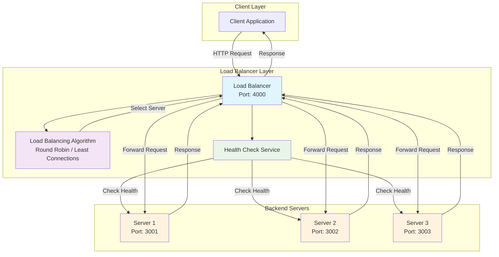

# Load Balancer Simulation

A Node.js-based load balancer simulation project that demonstrates different load balancing algorithms (Round Robin and Least Connections) with health checks, multiple backend servers, and comprehensive testing capabilities.

## Architecture and Data Flow

The system consists of three main components: Client, Load Balancer, and Backend Servers. Here's how requests flow through the system:



### Request Flow Steps

1. **Client Request**: Client sends HTTP request to Load Balancer (localhost:4000)

2. **Algorithm Selection**: Load Balancer uses configured algorithm to select backend server:
   - **Round Robin**: Cycles through servers sequentially
   - **Least Connections**: Routes to server with fewest active connections

3. **Health Check**: Before forwarding, Load Balancer checks server health:
   - Sends health check request to selected server
   - If unhealthy, tries up to 3 alternative servers
   - Falls back gracefully if all servers fail

4. **Request Forwarding**: Load Balancer forwards the original request to selected healthy server

5. **Server Processing**: Backend server processes the request and generates response:
   - Returns JSON with server port and process ID
   - Simulates real server workload

6. **Response Routing**: Load Balancer receives response and forwards it back to client

### Data Handling

- **Request Data**: HTTP headers, method, path, and body are preserved during forwarding
- **Response Data**: Server responses are streamed back to client without modification
- **Connection Management**: Keep-alive connections are maintained for performance
- **Error Handling**: 500 errors returned if all servers are unavailable
- **Timeout Management**: Configurable timeouts prevent hanging requests

### Key Components

- **Proxy Service**: Handles request forwarding and response streaming
- **Health Check**: Monitors server availability and performance
- **Load Balancing Algorithms**: Implements different distribution strategies
- **Configuration**: Environment-based settings for algorithms and timeouts
- **Logging**: Request/response logging for monitoring and debugging

## Features

- **Multiple Load Balancing Algorithms**: Round Robin and Least Connections
- **Health Checks**: Automatic server health monitoring
- **Configurable**: Environment-based configuration for algorithm selection and timeouts
- **Concurrent Load Testing**: Client application for batch load testing
- **Manual Testing Support**: Compatible with Postman for API testing
- **Logging**: Request logging with Morgan
- **Scalable Architecture**: Modular design with separate services

## Folder Structure

```
load-balancer-simulation/
├── package.json                 # Root package.json with scripts
├── client/                      # Load testing client
│   ├── package.json
│   ├── client.js               # Simple load test (1000 requests)
│   ├── loadTest.js             # Batch load test (100 concurrent batches)
│   └── Blast.js                # Additional test file
├── config/                      # Configuration files
│   └── servers.js              # Server list configuration
├── load-balancer/              # Load balancer service
│   ├── package.json
│   ├── src/
│   │   ├── index.js            # Main load balancer entry point
│   │   ├── algorithms/         # Load balancing algorithms
│   │   │   ├── roundRobin.js
│   │   │   └── leastConnections.js
│   │   ├── config/             # Configuration module
│   │   │   └── index.js
│   │   ├── routes/             # API routes
│   │   │   └── apiRoutes.js
│   │   ├── services/           # Business logic
│   │   │   └── proxyService.js
│   │   └── utils/              # Utilities
│   │       ├── healthCheck.js
│   │       └── logger.js
│   └── logs/                   # Log files
├── servers/                     # Backend server instances
│   ├── package.json
│   └── src/
│       ├── cluster.js          # Cluster management
│       ├── server.js           # Individual server
│       ├── controllers/        # Request handlers
│       │   └── apiController.js
│       └── routes/             # Server routes
│           └── apiRoutes.js
└── README.md                   # This file
```

## Prerequisites

- **Node.js**: Version 14.x or higher
- **npm**: Version 6.x or higher
- **Postman**: For manual API testing (optional)

## Installation

1. **Clone the repository**:
   ```bash
   git clone https://github.com/Nirajjj11/Load-balancer-simulation.git
   cd load-balancer-simulation
   ```

2. **Install root dependencies**:
   ```bash
   npm install
   ```

3. **Install dependencies for each service**:
   ```bash
   # Client dependencies
   cd client
   npm install
   cd ..

   # Load balancer dependencies
   cd load-balancer
   npm install
   cd ..

   # Servers dependencies
   cd servers
   npm install
   cd ..
   ```

## Configuration

Create a `.env` file in the `load-balancer` directory:

```env
# Load Balancer Configuration
PORT=4000
ALGORITHM=round  # Options: 'round' (Round Robin) or 'least' (Least Connections)
TIMEOUT=2000     # Request timeout in milliseconds
```

The servers are configured in `config/servers.js`:

```javascript
module.exports = [
    'http://localhost:3001',
    'http://localhost:3002',
    'http://localhost:3003'
];
```

## Running the Application

### Start All Services Simultaneously

```bash
npm start
```

This command runs all servers (ports 3001, 3002, 3003), the load balancer (port 4000), and starts the system.

### Start Services Individually

```bash
# Start individual servers
npm run server1  # Port 3001
npm run server2  # Port 3002
npm run server3  # Port 3003

# Start load balancer
npm run loadbalancer  # Port 4000

# Run load test client
npm run client
```

## Testing

### Manual Testing with Postman

1. **Start the application** using `npm start`

2. **Configure Postman**:
   - Method: `GET`
   - URL: `http://localhost:4000/api`

3. **Send Requests**:
   - Send multiple requests to see load distribution
   - Each request returns JSON with server port and process ID:
     ```json
     {
       "server": "3001",
       "pid": 12345
     }
     ```

4. **Test Load Balancing**:
   - Send 10-20 requests rapidly
   - Observe how requests are distributed across servers
   - Change `ALGORITHM` in `.env` and restart to test different algorithms

5. **Test Health Checks**:
   - Stop one server (Ctrl+C)
   - Continue sending requests
   - Observe automatic failover to healthy servers

### Load Testing with Client

The project includes two client testing scripts:

#### Simple Load Test (`client.js`)
- Sends 1000 sequential requests
- Measures completion time

```bash
cd client
node client.js
```

#### Batch Load Test (`loadTest.js`)
- Sends requests in batches of 100 concurrent requests
- Total: 1000 requests (10 batches)
- Measures total time and batch completion

```bash
cd client
node loadTest.js
```

**Expected Output**:
```
🚀 Starting 1000 requests...

Batch 1 completed
Batch 2 completed
...
Batch 10 completed

✅ Completed 1000 requests
⏱️ Time taken: 2500 ms
```

### Advanced Testing Scenarios

1. **Algorithm Comparison**:
   - Set `ALGORITHM=round` and run load tests
   - Change to `ALGORITHM=least` and compare distribution

2. **Failure Simulation**:
   - Start all services
   - Stop one server during testing
   - Observe automatic rerouting

3. **Performance Monitoring**:
   - Monitor server logs for request distribution
   - Check load balancer logs for forwarding decisions

## Performance and Capacity

### Request Handling Capacity

The load balancer simulation can handle thousands of concurrent requests depending on system resources and configuration:

- **Concurrent Connections**: Up to 10,000+ simultaneous connections (limited by Node.js and system resources)
- **Request Throughput**: 1,000-5,000 requests per second (depending on server hardware and network)
- **Memory Usage**: ~50-100MB for the load balancer process under normal load
- **CPU Usage**: Low overhead, primarily I/O bound

### Factors Affecting Performance

1. **System Resources**:
   - CPU cores and speed
   - Available RAM
   - Network bandwidth
   - Disk I/O (for logging)

2. **Configuration Settings**:
   - `TIMEOUT`: Request timeout (default 2000ms)
   - `ALGORITHM`: Load balancing strategy
   - Number of backend servers

3. **Backend Server Performance**:
   - Each server can handle 100-500 concurrent requests
   - Response time affects overall throughput
   - Server health and availability

### Load Testing Results

With the included client scripts:
- **1000 sequential requests**: Completes in 2-5 seconds
- **1000 concurrent requests (100 batches)**: Completes in 1-3 seconds
- **Load distribution**: Evenly balanced across 3 servers (333-334 requests each with Round Robin)

### Scaling Considerations

- **Horizontal Scaling**: Add more server instances to `config/servers.js`
- **Vertical Scaling**: Increase server resources (CPU, RAM)
- **Connection Pooling**: Axios handles connection reuse automatically
- **Health Checks**: Automatic failover prevents overloading unhealthy servers

### Monitoring Performance

Monitor key metrics:
- Response times per server
- Error rates
- CPU and memory usage
- Network I/O

## API Endpoints

### Load Balancer
- **GET** `/api` - Main endpoint that forwards requests to backend servers

### Backend Servers
- **GET** `/api` - Returns server information
  ```json
  {
    "server": "3001",
    "pid": 12345
  }
  ```

## Load Balancing Algorithms

### Round Robin
- Cycles through servers in order
- Equal distribution regardless of load
- Simple and predictable

### Least Connections
- Routes to server with fewest active connections
- Better for variable request processing times
- More complex but efficient for uneven loads

## Health Checks

- Automatic health monitoring of backend servers
- Failed servers are skipped automatically
- Up to 3 retry attempts per request
- Timeout configurable via environment variables

## Dependencies

### Root Dependencies
- `axios`: HTTP client for requests
- `concurrently`: Run multiple commands simultaneously
- `cross-env`: Cross-platform environment variables
- `dotenv`: Environment configuration
- `express`: Web framework

### Client Dependencies
- `axios`: HTTP client for load testing

### Load Balancer Dependencies
- `axios`: Forward requests to servers
- `dotenv`: Configuration management
- `express`: Web server framework
- `morgan`: HTTP request logger

### Server Dependencies
- `dotenv`: Configuration management
- `express`: Web server framework

## Best Practices

1. **Environment Configuration**: Use `.env` files for configuration
2. **Error Handling**: Comprehensive error handling in proxy service
3. **Logging**: Request logging for monitoring and debugging
4. **Health Checks**: Automatic server health monitoring
5. **Modular Architecture**: Separated concerns (algorithms, services, utils)
6. **Concurrent Testing**: Batch testing to simulate real-world load
7. **Scalability**: Easy to add more servers or algorithms

## Troubleshooting

### Common Issues

1. **Port Conflicts**: Ensure ports 3001-3003 and 4000 are available
2. **Dependencies**: Run `npm install` in each service directory
3. **Environment Variables**: Check `.env` file in load-balancer directory

### Logs
- Load balancer logs: `load-balancer/logs/`
- Server logs: Check terminal output for each server

## Contributing

1. Fork the repository
2. Create a feature branch
3. Make your changes
4. Add tests if applicable
5. Submit a pull request

## License

ISC License - see package.json for details

## Repository

[GitHub Repository](https://github.com/Nirajjj11/Load-balancer-simulation)